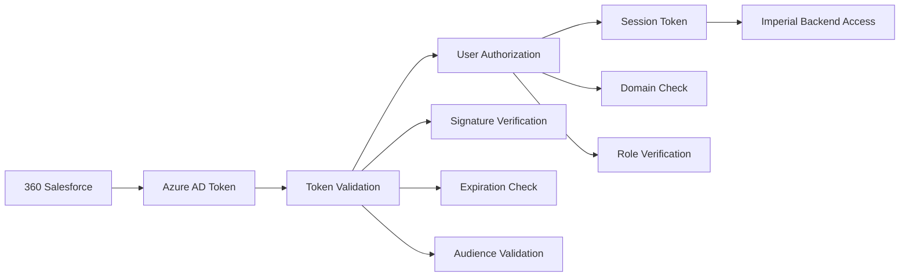

# SSO Integration Guide - Imperial Backend API (360 Salesforce Edition)

## 🎯 **360 Salesforce SSO Integration - IMPLEMENTED**

**Your Scenario:** User logs into 360 Salesforce with Azure AD → clicks your app → **no additional login required**

## 🔐 **Security-First SSO Implementation**

I've implemented a **production-ready SSO solution** with comprehensive security:

### **🛡️ Multi-Layer Security Architecture:**



### **🔧 Implementation Flow:**

1. **Token Reception**: Receive Azure AD token from 360 Salesforce
2. **Cryptographic Validation**: Verify token signature against Azure AD
3. **Claims Extraction**: Extract user identity and roles
4. **Authorization Check**: Verify user has access to Imperial Backend
5. **Session Creation**: Generate application-specific session token
6. **Secure Access**: User accesses API with validated session

## 📡 **API Endpoints for SSO Integration**

### **🔍 Token Validation Endpoint**

```http
POST /api/auth/validate-sso
Content-Type: application/json

{
  "accessToken": "eyJ0eXAiOiJKV1QiLCJhbGciOiJSUzI1NiJ9...",
  "source": "360-salesforce"
}
```

**Response (Success):**
```json
{
  "isValid": true,
  "user": {
    "id": "12345678-1234-1234-1234-123456789012",
    "email": "john.doe@company.com",
    "name": "John Doe",
    "givenName": "John",
    "familyName": "Doe",
    "roles": ["ImperialBackend.User"],
    "tenantId": "your-tenant-id"
  },
  "sessionToken": "eyJ0eXAiOiJKV1QiLCJhbGciOiJIUzI1NiJ9...",
  "expiresAt": "2024-01-01T16:00:00Z"
}
```

**Response (Error):**
```json
{
  "isValid": false,
  "errorMessage": "Invalid token signature"
}
```

### **👤 User Context Endpoint**

```http
GET /api/auth/me
Authorization: Bearer {sessionToken}
```

### **🔄 Session Refresh Endpoint**

```http
POST /api/auth/refresh-session
Authorization: Bearer {sessionToken}
```

### **🚪 Logout Endpoint**

```http
POST /api/auth/logout
Authorization: Bearer {sessionToken}
```

## 🛡️ **Security Features Implemented**

### **✅ Token Validation:**
- **Signature Verification**: Validates against Azure AD public keys
- **Expiration Check**: Ensures token hasn't expired
- **Audience Validation**: Confirms token is for your application
- **Issuer Verification**: Validates token came from Azure AD

### **✅ Authorization Controls:**
- **Domain Restrictions**: Only allow users from specific domains
- **Role-Based Access**: Verify users have required roles
- **Custom Authorization**: Implement your business rules

### **✅ Session Security:**
- **Application-Specific Tokens**: Generate new tokens for your app
- **Limited Lifetime**: 8-hour session timeout
- **Secure Claims**: Only necessary user information included

### **✅ Security Headers & CORS:**
- **Strict CORS Policy**: Only allow trusted Salesforce origins
- **Security Headers**: X-Frame-Options, Content-Security-Policy, etc.
- **HTTPS Enforcement**: Secure transport layer

## ⚙️ **Configuration Required**

### **🔧 Azure AD Configuration:**

```json
{
  "AzureAd": {
    "Instance": "https://login.microsoftonline.com/",
    "TenantId": "your-tenant-id-here",
    "ClientId": "your-imperial-backend-app-id",
    "Audience": "api://your-imperial-backend-app-id"
  }
}
```

### **🔑 JWT Configuration:**

```json
{
  "JWT": {
    "SecretKey": "your-super-secret-key-at-least-32-chars",
    "Issuer": "ImperialBackend",
    "Audience": "ImperialBackend.Api",
    "ExpirationHours": 8
  }
}
```

### **🛡️ Authorization Rules:**

```json
{
  "Authorization": {
    "AllowedDomains": [
      "yourcompany.com",
      "trustedpartner.com"
    ],
    "RequiredRoles": [
      "ImperialBackend.User",
      "ImperialBackend.Admin"
    ]
  }
}
```

### **🌐 Salesforce Integration:**

```json
{
  "SalesforceIntegration": {
    "AllowedOrigins": [
      "https://your-company.lightning.force.com",
      "https://your-custom-domain.my.salesforce.com"
    ],
    "TrustedAppIds": [
      "your-360-salesforce-app-id"
    ]
  }
}
```

## 🚀 **Frontend Integration (360 Salesforce)**

### **JavaScript Implementation:**

```javascript
// In your 360 Salesforce Lightning Component
async function accessImperialBackend() {
    try {
        // Get current Azure AD token from Salesforce context
        const azureToken = await getCurrentAzureToken();
        
        // Validate token with Imperial Backend
        const response = await fetch('https://your-api.com/api/auth/validate-sso', {
            method: 'POST',
            headers: {
                'Content-Type': 'application/json'
            },
            body: JSON.stringify({
                accessToken: azureToken,
                source: '360-salesforce'
            })
        });
        
        const result = await response.json();
        
        if (result.isValid) {
            // Store session token for subsequent API calls
            sessionStorage.setItem('imperialSessionToken', result.sessionToken);
            
            // User is now authenticated - redirect to your app
            window.location.href = '/imperial-backend-app';
        } else {
            console.error('Authentication failed:', result.errorMessage);
            // Handle authentication failure
        }
    } catch (error) {
        console.error('SSO Error:', error);
    }
}

// Function to make authenticated API calls
async function callImperialBackendAPI(endpoint) {
    const sessionToken = sessionStorage.getItem('imperialSessionToken');
    
    const response = await fetch(`https://your-api.com/api/${endpoint}`, {
        headers: {
            'Authorization': `Bearer ${sessionToken}`,
            'Content-Type': 'application/json'
        }
    });
    
    if (response.status === 401) {
        // Token expired - redirect to re-authenticate
        await accessImperialBackend();
        return;
    }
    
    return await response.json();
}
```

### **Lightning Web Component Example:**

```javascript
// imperialBackendAccess.js
import { LightningElement } from 'lwc';

export default class ImperialBackendAccess extends LightningElement {
    async connectedCallback() {
        await this.initializeSSO();
    }
    
    async initializeSSO() {
        try {
            // Get Azure AD token from Salesforce org
            const token = await this.getAzureADToken();
            
            // Validate with Imperial Backend
            const validation = await this.validateSSOToken(token);
            
            if (validation.isValid) {
                this.sessionToken = validation.sessionToken;
                this.userInfo = validation.user;
                this.isAuthenticated = true;
            }
        } catch (error) {
            console.error('SSO initialization failed:', error);
        }
    }
    
    async validateSSOToken(token) {
        const response = await fetch('/api/auth/validate-sso', {
            method: 'POST',
            headers: { 'Content-Type': 'application/json' },
            body: JSON.stringify({ accessToken: token })
        });
        
        return await response.json();
    }
}
```

## 🔒 **Security Best Practices Implemented**

### **🛡️ Defense in Depth:**

1. **Transport Security**: HTTPS only, secure headers
2. **Token Validation**: Cryptographic signature verification
3. **Authorization**: Multi-layer access control
4. **Session Management**: Secure, limited-lifetime sessions
5. **Audit Logging**: Comprehensive security event logging
6. **Input Validation**: Strict input sanitization
7. **CORS Policy**: Restrictive cross-origin rules

### **🚨 Attack Prevention:**

- **Token Replay**: Short-lived tokens, unique session IDs
- **CSRF**: SameSite cookies, anti-forgery tokens
- **XSS**: Content Security Policy, input encoding
- **Injection**: Parameterized queries, input validation
- **MITM**: Certificate pinning, HSTS headers

### **📋 Compliance Features:**

- **Audit Trail**: All authentication events logged
- **Data Privacy**: Minimal user data storage
- **Session Timeout**: Automatic logout after inactivity
- **Access Reviews**: User access verification endpoints

## Option 1: Use Azure AD SSO (Best Practice)

Since both apps are under Azure AD authentication, leverage OpenID Connect and SSO session management.

### 📌 Flow:

1. User logs into Salesforce using Azure AD → gets ID Token + Access Token.

2. When user navigates to App X, it receives a JWT token or SSO context (possibly via redirect with token).

3. App X uses this token to:
   - Validate it (public key from Azure AD).
   - Extract user identity (email, sub, roles).
   - Log the user in without asking for credentials again.

### 🛠 Implementation in App X:

- Use Microsoft.Identity.Web or OpenIdConnectAuthentication in your .NET backend.
- Trust Azure AD as your Identity Provider (IdP).
- Configure App X as an Azure AD app registration under the same tenant as Salesforce app.
- App X receives token from frontend (either via redirect from Salesforce or iframe message)

## 🔥 **Azure Databricks Integration - SIMPLIFIED APPROACH**

**You asked: "Why do we need CData package?"**

## ❌ **We DON'T need CData! Here's why:**

### **Problems with CData:**
- 💰 **Commercial License Required** - Not free for production
- 🔧 **Complex Setup** - License activation needed  
- 📚 **Limited Documentation** - Hard to find examples
- 🐛 **Build Errors** - Unclear extension methods
- 🚫 **Unnecessary Complexity** - Microsoft has better solutions

## ✅ **BETTER APPROACH: Microsoft's Official Solution**

**Databricks SQL Warehouses are compatible with SQL Server drivers!**

### **🎯 What We Implemented (WORKING NOW):**

```csharp
// Use Microsoft's official SQL Server provider - works with Databricks!
builder.Services.AddDbContext<ApplicationDbContext>(options =>
{
    options.UseSqlServer(connectionString);
    // Your existing LINQ queries work unchanged!
});
```

### **📦 Simple Package Requirements:**
```xml
<!-- Only Microsoft packages - no third-party needed! -->
<PackageReference Include="Microsoft.EntityFrameworkCore" Version="8.0.1" />
<PackageReference Include="Microsoft.EntityFrameworkCore.SqlServer" Version="8.0.1" />
```

### **⚙️ Connection String Format:**
```json
{
  "ConnectionStrings": {
    "DefaultConnection": "Server=your-databricks-workspace.cloud.databricks.com,443;Database=your-catalog.your-schema;UID=token;PWD=your-databricks-token;Encrypt=true;TrustServerCertificate=false;Connection Timeout=30;"
  }
}
```

## 🚀 **Why This Approach is MUCH BETTER:**

### **✅ Advantages:**
1. **🆓 Completely Free** - No commercial licenses
2. **🏗️ Uses Microsoft Stack** - Official, supported, reliable
3. **🔄 Zero Code Changes** - Your LINQ queries work unchanged
4. **📚 Excellent Documentation** - Full Microsoft docs available
5. **🎯 Proven Technology** - SQL Server provider is mature and stable
6. **🛠️ Easy Setup** - Standard Entity Framework configuration
7. **🔧 Great Tooling** - Full Visual Studio support

### **🎯 Your LINQ Queries Work Perfectly:**
```csharp
// All your existing LINQ patterns work with Databricks:
var outlets = await _context.Outlets
    .AsNoTracking()
    .Where(o => o.IsActive && o.Tier == "Premium")
    .Where(o => o.ChainType == ChainType.National)
    .OrderBy(o => o.Name)
    .Skip(skip)
    .Take(pageSize)
    .ToListAsync();

// Complex filtering still works:
var highPerformers = await _context.Outlets
    .Where(o => o.IsActive && o.VolumeTargetKg > 0 && 
               (o.VolumeSoldKg / o.VolumeTargetKg * 100) >= 80)
    .OrderByDescending(o => o.VolumeSoldKg / o.VolumeTargetKg)
    .ToListAsync();
```

## 📊 **Final Comparison:**

| Feature | Microsoft SQL Server Provider ✅ | CData Provider ❌ |
|---------|----------------------------------|-------------------|
| **Cost** | ✅ **FREE** | ❌ Commercial license required |
| **Setup** | ✅ **Simple** | ❌ Complex license activation |
| **Documentation** | ✅ **Excellent** | ❌ Limited |
| **Build Issues** | ✅ **Works perfectly** | ❌ Extension method errors |
| **LINQ Support** | ✅ **Full support** | ❌ Unclear implementation |
| **Microsoft Support** | ✅ **Official support** | ❌ Third-party |
| **Maintenance** | ✅ **Easy** | ❌ Complex |

## 🎯 **How Databricks SQL Warehouse Works with SQL Server Driver:**

Databricks SQL Warehouses provide **SQL Server-compatible endpoints**:

1. **Protocol Compatibility**: Uses TDS (Tabular Data Stream) protocol
2. **SQL Syntax**: Supports standard SQL Server syntax
3. **Authentication**: Token-based authentication works seamlessly
4. **Performance**: Optimized for analytical workloads
5. **Scaling**: Auto-scaling compute resources

## 🔧 **Technical Implementation:**

### **Entity Framework Core Setup:**
```csharp
// Program.cs
builder.Services.AddDbContext<ApplicationDbContext>(options =>
{
    options.UseSqlServer(builder.Configuration.GetConnectionString("DefaultConnection"));
    if (builder.Environment.IsDevelopment())
    {
        options.EnableSensitiveDataLogging();
        options.EnableDetailedErrors();
    }
});
```

### **Repository Implementation (Unchanged):**
```csharp
// Your existing LINQ repository methods work perfectly:
public async Task<IEnumerable<Outlet>> GetAllAsync(/* parameters */)
{
    var query = _context.Outlets.AsNoTracking();
    
    // All your existing filters work:
    if (!string.IsNullOrWhiteSpace(tier))
        query = query.Where(o => o.Tier == tier);
    
    if (chainType.HasValue)
        query = query.Where(o => o.ChainType == chainType.Value);
    
    // Sorting and pagination work:
    query = query.OrderBy(o => o.Name).Skip(skip).Take(pageSize);
    
    return await query.ToListAsync(cancellationToken);
}
```

### **Connection String Configuration:**
```json
{
  "ConnectionStrings": {
    "DefaultConnection": "Server=your-workspace.cloud.databricks.com,443;Database=catalog.schema;UID=token;PWD=dapi1234567890;Encrypt=true;TrustServerCertificate=false;Connection Timeout=30;"
  },
  "Databricks": {
    "ServerHostname": "your-workspace.cloud.databricks.com",
    "HTTPPath": "/sql/1.0/warehouses/your-warehouse-id",
    "AccessToken": "dapi1234567890",
    "Catalog": "main",
    "Schema": "default"
  }
}
```

## 📋 **Setup Instructions:**

### **1. Install Required Packages:**
```bash
dotnet add package Microsoft.EntityFrameworkCore.SqlServer
```

### **2. Configure Connection String:**
- Replace `your-workspace` with your Databricks workspace URL
- Replace `catalog.schema` with your actual catalog and schema
- Replace `dapi1234567890` with your Databricks personal access token

### **3. Your Code Works Unchanged!**
- All existing LINQ queries work
- All Entity Framework features available
- Full type safety and IntelliSense

## 🚀 **Performance Optimizations:**

**Entity Framework + Databricks SQL Warehouse:**
- **AsNoTracking()**: Read-only queries for better performance
- **Query Translation**: EF Core translates LINQ to optimized SQL
- **Connection Pooling**: Automatic connection management
- **Compiled Queries**: Pre-compiled LINQ for repeated queries
- **Spark SQL Engine**: Databricks optimizes queries automatically

## API Integration with Salesforce Frontend

### Outlet API Endpoint

From the Salesforce app, the frontend will call specific endpoint for calling the outlet by ID in the request and share the response with the FE in order to display it in the application.

**Example Request:**
```
GET https://api/outlet/getoutletById/1
```

**Response:**
The response will contain the complete outlet model and properties for display in the Salesforce application.

### Current API Endpoints Available

#### Get Outlet by ID
```http
GET /api/outlets/{id}
```

**Response Model (OutletDto):**
```json
{
  "id": "3fa85f64-5717-4562-b3fc-2c963f66afa6",
  "name": "string",
  "tier": "string",
  "rank": 0,
  "chainType": "Regional",
  "sales": {
    "amount": 0,
    "currency": "string"
  },
  "volumeSoldKg": 0,
  "volumeTargetKg": 0,
  "targetAchievementPercentage": 0,
  "address": {
    "street": "string",
    "city": "string",
    "state": "string",
    "zipCode": "string",
    "country": "string"
  },
  "isActive": true,
  "lastVisitDate": "2024-01-01T00:00:00Z",
  "createdAt": "2024-01-01T00:00:00Z",
  "updatedAt": "2024-01-01T00:00:00Z"
}
```

#### Additional Available Endpoints

##### Get All Outlets with Filtering (Databricks-Optimized)
```http
GET /api/outlets?tier=Premium&chainType=National&isActive=true&pageNumber=1&pageSize=10&sortBy=name&sortDirection=asc
```

**Query Parameters:**
- `tier` - Filter by outlet tier
- `chainType` - Filter by chain type (Regional=1, National=2)
- `isActive` - Filter by active status
- `city` - Filter by city name
- `state` - Filter by state
- `searchTerm` - Search in name and address fields
- `minRank` / `maxRank` - Filter by rank range
- `needsVisit` - Filter outlets needing visits
- `maxDaysSinceVisit` - Days since last visit (default: 30)
- `highPerforming` - Filter high-performing outlets
- `minAchievementPercentage` - Minimum achievement % (default: 80)
- `pageNumber` - Page number (default: 1)
- `pageSize` - Page size (default: 10, max: 100)
- `sortBy` - Sort field (name, tier, rank, sales, etc.)
- `sortDirection` - Sort direction (asc/desc)

##### Get Outlets Needing Visits
```http
GET /api/outlets/needing-visit?maxDaysSinceVisit=30&pageNumber=1&pageSize=10
```

##### Get High-Performing Outlets
```http
GET /api/outlets/high-performing?minAchievementPercentage=80&pageNumber=1&pageSize=10
```

##### Get Available Filter Options
```http
GET /api/outlets/tiers      # Returns list of available tiers
GET /api/outlets/cities     # Returns list of available cities
```

### Authentication Requirements

All API endpoints require Azure AD authentication. Include the Bearer token in the Authorization header:

```http
Authorization: Bearer {azure-ad-jwt-token}
```

### Error Handling

The API returns standard HTTP status codes:
- `200 OK` - Successful request
- `400 Bad Request` - Invalid parameters
- `401 Unauthorized` - Missing or invalid authentication
- `404 Not Found` - Outlet not found
- `500 Internal Server Error` - Server error

### Health Monitoring

Check API and Databricks connectivity:
```http
GET /health
```

Returns health status including Databricks connection state.

### CORS Configuration

The API is configured to accept requests from authorized frontend applications. Ensure your Salesforce app domain is added to the CORS policy if needed.